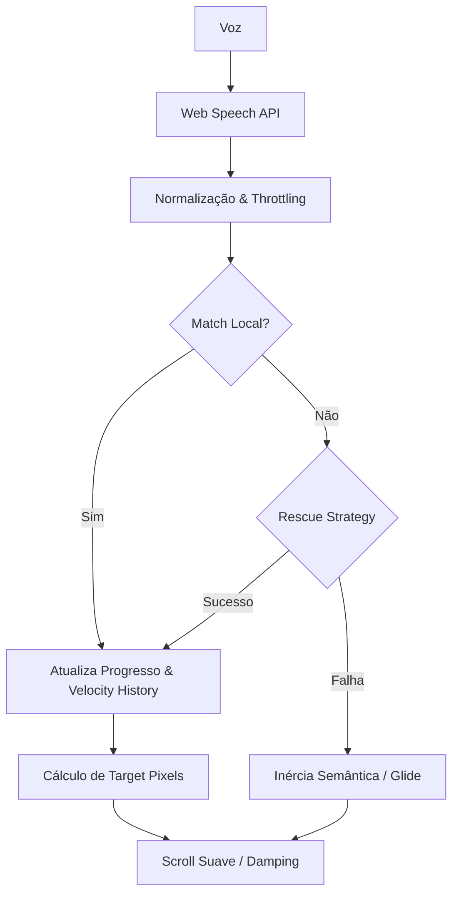

# Lógica do Controle de Voz (PromptNinja) - Estado Atual

Este documento detalha o funcionamento técnico do sistema de controle de voz, refletindo a implementação atual no código.

## 1. Arquitetura de Estados

O sistema opera em uma hierarquia de três níveis para garantir estabilidade e precisão:

### A. Travamento de Sentença (Sentence Locking)
O sistema mantém uma **Active Sentence (Sentença Ativa)**. 
- **Hysteresis:** Para mudar a Sentença Ativa, o sistema exige confirmações baseadas em tempo e quadros (`REQUIRED_CONFIRMATIONS` ou `MS`) ou uma correspondência de alta confiança (`INSTANT_MATCH_THRESHOLD` > 0.90). Isso evita que ruídos causem pulos acidentais.
- **Adaptive Throttling:** O processamento da fala é limitado dinamicamente (`THROTTLE_MS`) para economizar CPU, processando apenas quando há mudanças significativas na transcrição ou respeitando limites de desempenho.

### B. Progresso Intra-Sentença
Dentro da frase travada, o progresso (0.0 a 1.0) é calculado continuamente.
- **Fuzzy Sync:** Permite que o scroll avance mesmo se palavras forem puladas ou ditas de forma ligeiramente diferente, mantendo o foco visual no ponto correto de leitura.

### C. Inteligência Adaptativa
O sistema "aprende" com o usuário durante a sessão (armazenado em `VoiceProfile` no localStorage):
- **Confidence Learning:** O sistema avalia a qualidade dos matches para ajustar limiares de aceitação.
- **Adaptive WPM:** Calcula a velocidade média de leitura (Palavras Por Minuto) para ajustar o `SCROLL_LERP_FACTOR` da sessão, tornando o movimento mais natural para locutores rápidos ou lentos.

---

## 2. Motor de Comparação (Matching Engine)

O `stringSimilarity.ts` utiliza um sistema multi-sinal:
1.  **Levenshtein Distance:** Compara a diferença bruta de caracteres.
2.  **Stemming (Snowball):** Reduz palavras aos radicais (ex: "correndo" -> "corr").
3.  **Fonética (Double Metaphone):** Gera códigos baseados no som. Se o match visual for fraco mas o som for idêntico, o sistema aplica um bônus de confiança (`phoneticWeight`).
4.  **Jump Penalty:** Implementa uma penalidade exponencial baseada na distância do pulo (`JUMP_PENALTY.k`). Pulos maiores exigem uma clareza de fala significativamente maior para serem aceitos.

---

## 3. Dinâmica de Scroll e Física

O scroll é gerenciado por camadas de física no `useScrollPhysics.ts`:

### A. Camadas de Amortecimento (Damping)
- **Initial Snap:** Se o primeiro match estiver longe da posição atual, o sistema realiza um salto instantâneo (`INITIAL_SNAP_THRESHOLD`) para evitar um deslize longo e cansativo.
- **Oscillation Filtering:** Pequenas variações de "vai e vem" na transcrição são filtradas (`OSCILLATION_THRESHOLD`) para evitar que a tela trema.
- **Jerk Limit:** Limita a variação brusca de velocidade, garantindo acelerações suaves.

### B. Inércia Semântica (Grace Inertia)
O sistema não para imediatamente se a voz falhar ou em pausas curtas:
- **Velocity History:** Mantém um histórico (`HISTORY_MS`) da velocidade dos últimos matches realizados.
- **Glide (Grace Duration):** Se o match falha, o prompter continua deslizando na velocidade média recente por um período (`STALL_THRESHOLD_MS`), aplicando um decaimento suave (`VELOCITY_DECAY`).
- **Inertial Sentences:** Sentenças marcadas como `isInertial` (tags `<...>` ou acordes) mantém a inércia ativa para "atravessar" esses segmentos sem interrupção.

---

## 4. Recuperação de Erros (Rescue)

Quando o sistema perde a sincronia, ele aplica estas estratégias em ordem:
1.  **Look-Ahead:** Verifica a frase seguinte imediata.
2.  **Segmented Matching:** Quebra a fala em fragmentos menores (n-grams) para encontrar um novo ponto de ancoragem no texto.
3.  **Emergency Recovery:** Após várias falhas consecutivas (`FAILURE_THRESHOLD`), o sistema relaxa os limiares de confiança (`RELAXED_CONFIDENCE`) para facilitar o reencontro com a fala do usuário.

---

## Fluxo de Dados

