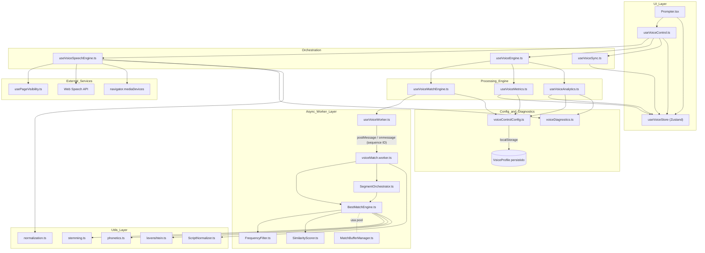

# Lógica do Controle de Voz (PromptNinja) - Reanálise e Otimização Março 2026

Este documento detalha o funcionamento técnico do sistema de controle de voz, refletindo a implementação modular atual e o plano de otimização de performance.

---

## 1. Arquitetura de Estados e Orquestração

O sistema foi extensivamente modularizado em camadas com responsabilidades bem definidas.

### A. Orquestrador Principal (`useVoiceControl.ts`)
Atua como **Facade** que coordena 3 sub-engines principais e sincroniza os dados para o Zustand store global:
- **`useVoiceEngine`**: Orquestrador de processamento (Busca + Métricas + Analytics).
- **`useVoiceSpeechEngine`**: Interface com a Web Speech API (hardware + lifecycle).
- **`useVoiceSync`**: Gestor de posição no script (`activeSentenceIndex` e `voiceProgress`), lê **diretamente do Zustand**, sem prop drilling.

**Fluxo principal:**
```
transcript → useVoiceEngine.processTranscript() → match result → useVoiceSync.updatePosition() → Zustand Store → UI
```

### B. Camadas Especializadas
1. **Hardware (`useVoiceSpeechEngine.ts`)**: SpeechRecognition lifecycle, auto-restart, backoff exponencial, cache de segmentos normalizados, integração com `usePageVisibility`.
2. **Motor (`useVoiceEngine.ts`)**: Pipeline de processamento: calibração de ruído → match → atualização de velocidade → analytics.
3. **Busca (`useVoiceMatchEngine.ts`)**: Bridge para o Web Worker. Calcula `searchWindow` adaptativa (WPM-aware) e ativa Global Search Fallback após 3 falhas seguidas.
4. **Worker Bridge (`useVoiceWorker.ts`)**: Gerencia ciclo de vida do Worker (init, postMessage, sequence ID, auto-heal com até 3 restarts).
5. **Métricas (`useVoiceMetrics.ts`)**: WPM adaptativo, EMA de performance, confidence learning, noise detection. Publica `adaptedLerpFactor` no Zustand.
6. **Analytics (`useVoiceAnalytics.ts`)**: Telemetria de sessão (duração, WPM, matchRate). Grava no Zustand (`sessionSummary`) e persiste resumo via `updateVoiceProfile`.

---

## 2. Mapa de Dependências Completo (Atualizado)


```mermaid
graph TD
    subgraph UI_Layer
        PR[Prompter.tsx] --> VC[useVoiceControl.ts]
        PR --> VS_store["useVoiceStore (Zustand)"]
    end

    subgraph Orchestration
        VC --> SE[useVoiceSpeechEngine.ts]
        VC --> VE[useVoiceEngine.ts]
        VC --> VS[useVoiceSync.ts]
        VC --> VS_store
    end

    subgraph External_Services
        SE --> PV[usePageVisibility.ts]
        SE --> SpeechAPI[Web Speech API]
        SE --> MediaDevices[navigator.mediaDevices]
    end

    subgraph Processing_Engine
        VE --> ME[useVoiceMatchEngine.ts]
        VE --> MT[useVoiceMetrics.ts]
        VE --> AN[useVoiceAnalytics.ts]
        MT --> VS_store
        AN --> VS_store
        VS --> VS_store
    end

    subgraph Async_Worker_Layer
        ME --> VW[useVoiceWorker.ts]
        VW -- "postMessage / onmessage (sequence ID)" --> Worker[voiceMatch.worker.ts]
        Worker --> BME[BestMatchEngine.ts]
        Worker --> SO[SegmentOrchestrator.ts]
        SO --> BME
        BME --> FF[FrequencyFilter.ts]
        BME --> SS[SimilarityScorer.ts]
        BME -. usa pool .- MBM[MatchBufferManager.ts]
    end

    subgraph Config_and_Diagnostics
        ME --> CFG[voiceControlConfig.ts]
        MT --> CFG
        AN --> CFG
        AN --> DIAG[voiceDiagnostics.ts]
        SE --> DIAG
        CFG -- "localStorage" --> Profile[(VoiceProfile persistido)]
    end

    subgraph Utils_Layer
        SE --> norm[normalization.ts]
        BME --> stem[stemming.ts]
        BME --> phon[phonetics.ts]
        BME --> lev[levenshtein.ts]
        Worker --> ScriptNorm[ScriptNormalizer.ts]
    end
```

---

## 3. Pipeline de Busca (Multi-fase)

O sistema de busca mantém 60fps no Main Thread através de processamento assíncrono e otimizações binárias:

1. **Web Worker (Assíncrono)**: Todo fuzzy matching ocorre em `voiceMatch.worker.ts`. O Main Thread apenas posta mensagens e lê o último resultado disponível (fire-and-forget com sequence ID).
2. **MatchBufferPool**: Pool de `Int32Array`/`Uint16Array` no `MatchBufferManager.ts`, eliminando GC pressure em alta frequência.
3. **Pre-normalized Uint16Array Buffer**: O script inteiro é convertido para charcodes normalizados uma única vez. `FrequencyFilter`, `SimilarityScorer` e `BestMatchEngine` operam diretamente sobre este buffer binário.
4. **Sequence Tracking (Request ID)**: Apenas o resultado do transcript mais recente é aplicado — race conditions assíncronas eliminadas.
5. **FrequencyFilter (Fase 1)**: Filtro O(n) por frequência de caracteres que reduz drasticamente o espaço de busca antes do Levenshtein.
6. **BestMatchEngine (Fase 2)**: Pipeline de 4 fases: pre-processing → candidate generation → detailed scoring → fallback scan.
7. **SegmentOrchestrator (Fase 3 — Recovery)**: Quebra transcrições longas em n-grams sobrepostos, faz cluster por posição e valida consenso. Ativo somente quando `BestMatchEngine` falha e transcript > 3 palavras.
8. **Global Search Fallback**: Após 3 falhas consecutivas, `isGlobalSearch=true` desabilita janela local e jump penalty, varrendo o script inteiro com threshold relaxado (0.1 menor).
9. **WPM-Aware Search Window**: A `searchWindow` escala 0.7x–1.5x em função do `currentWPM` do locutor.
10. **Métricas Offload**: Contagem de palavras calculada dentro do Worker, liberando Main Thread.

---

## 4. Histórico de Otimizações Realizadas (Março 2026)

O sistema passou por múltiplas auditorias e ciclos de refatoração. Segue o histórico consolidado:

1. **Web Worker Integration**: Todo o processamento de fuzzy matching movido para `voiceMatch.worker.ts`, mantendo Main Thread a 60fps.
2. **MatchBufferPool**: Pool de `Int32Array`/`Uint16Array` (até 4096 chars) no `MatchBufferManager.ts`, reduzindo GC.
3. **Pre-normalized Char-Buffer**: Script convertido para `Uint16Array` de charcodes. Motores de busca operam sobre buffer binário, eliminando alocações de string.
4. **SimilarityScorer de Alta Performance**: `TextDecoder('utf-16')` + fast-path para aborto precoce de scores ruins.
5. **Normalização Incremental com Cache**: `useVoiceSpeechEngine.ts` cacheia segmentos finalizados do transcript via `normalizedSegmentsRef` (Map). Cache limpo nos auto-restarts.
6. **Métricas baseadas em Refs**: Todos os hooks de métricas usam `useRef` ao invés de `useState`, eliminando re-renders por telemetria.
7. **Busca Adaptativa (WPM-Aware)**: `searchWindow` escala dinamicamente (0.7x a 1.5x) com base no ritmo do locutor.
8. **Auto-healing do Worker**: Restart automático do Web Worker (até 3x) em falhas críticas ou erros de memória.
9. **Pattern Normalization em Uint16Array**: Buffer passado por referência pelas fases de busca, eliminando conversões desnecessárias.
10. **Cache de Phonetics e Stemming**: `PATTERN_CACHE` no Worker (LRU simples de 50 entradas) evita recalcular stemming/fonética para transcrições repetidas.
11. **Remoção da classe VoicePipeline**: Processamento realizado diretamente nos hooks, reduzindo indireção e prop drilling.
12. **Tipagem Estrita e Error Handling no Worker**: Discriminated Unions, `try/catch` global e payload de erro estruturado para auto-heal.
13. **Correção de Stale Cache**: Limpeza do `normalizedSegmentsRef` inserida no `recycleSession` e auto-restart da recognition.
14. **Correção de Worker Deadlock**: Main thread escuta payloads `ERROR` do Worker, permitindo auto-restart via `initWorker`.
15. **Avaliação de SharedArrayBuffer**: Descartado (bloqueios COOP/COEP e ganho não-justificável).
16. **Recuperação Profunda (Global Search Fallback)**: Mecanismo no Worker que varre o script completo após 3 falhas na janela local, com threshold relaxado.
17. **Graceful Degradation com Backoff Exponencial**: `useVoiceSpeechEngine` implementa backoff (`2^n * 500ms`, max 5s) após erros consecutivos, com threshold de 5 falhas para interrupção total e UI feedback.
18. **Page Visibility API**: `useVoiceSpeechEngine` suspende a recognition quando a guia entra em background e retoma imediatamente ao voltar ao foreground, poupando bateria e evitando throttling do browser.
19. **useVoiceSync via Zustand**: `useVoiceSync` lê e escreve diretamente no Zustand store (`setActiveSentenceIndex`, `setVoiceProgress`) — sem prop drilling no orquestrador.
20. **AdaptiveVoiceConfig com Persistência**: Config auto-adaptativa persiste perfil do usuário no `localStorage` (WPM médio, preferredLerpFactor, histórico de accuracy/sessões), refinando parâmetros entre sessões.
21. **SegmentOrchestrator (N-gram Clustering)**: Novo `SegmentOrchestrator.ts` para recovery de transcrições longas e ruidosas via n-gram sobrepostos com cluster de consenso.
22. **Configurações de LANGUAGE_OVERRIDES**: Parâmetros específicos por idioma (`pt`, `en`) para `intraSentenceTolerance`, `stemWeight`, `phoneticWeight` — matching mais preciso por contexto linguístico.
23. **Emergency Recovery Mode**: Config `EMERGENCY_RECOVERY` ativa modo de threshold relaxado após 8 falhas em 3s, com `FORCE_ADVANCE_ON_SPEECH` como última salvaguarda.
24. **VoiceDiagnostics com export JSON**: Singleton de diagnóstico registra matches, misses, jumps, performance e stuck events. Gera recomendações acionáveis e pode exportar JSON para análise externa. Exposto em `window.voiceDiagnostics` e `window.downloadVoiceReport` para debug.

---

## 5. Lacunas e Melhorias Identificadas (Reanálise)

Após reanálise completa (Março 2026), as otimizações anteriores foram **todas implementadas**. As lacunas atuais são pontuais e focadas em robustez, consistência e eficiência operacional:

---

### A. Worker Re-inicializado ao Mudar o Script (Instabilidade)

**Problema (Crítico):** Em `useVoiceWorker.ts`, o `useEffect` tem `initWorker` na dependência, e `initWorker` depende de `script` e `scriptBuffer`. Toda vez que o texto do script muda (ex: usuário edita o roteiro enquanto está ao ar), um novo Worker é criado, terminando o anterior mid-flight. A mensagem `INIT` do novo Worker pode chegar **após** uma mensagem `MATCH` em voo, causando um resultado perdido, e o `restartCountRef` é resetado incorretamente.

**Oportunidade:** Separar a inicialização do Worker da atualização do script. Usar a mensagem `UPDATE_SCRIPT` (já existe no `WorkerMessage` type do worker!) para enviar o novo script ao Worker existente, sem recriar o processo. Só recriar o Worker em caso de erro real.

```typescript
// Ao invés de recriar o worker via useEffect quando o script muda,
// enviar UPDATE_SCRIPT para o worker existente:
workerRef.current.postMessage({ type: 'UPDATE_SCRIPT', payload: { script, scriptBuffer } });
```

---

### B. `postMatch` Descarta Mensagens se `isProcessing=true` (Silent Drop)

**Problema (Médio):** Em `useVoiceWorker.ts`, se o Worker ainda está processando uma requisição anterior quando chega um novo transcript, o `postMatch` retorna silenciosamente (`if (!workerRef.current || isProcessingRef.current) return`). Para *interim results* isso é aceitável (fire-and-forget), mas para **resultados finais** (`isFinal=true`) — onde a precisão é crítica — silenciosamente ignorar o transcript é uma perda de dados.

**Oportunidade:** Implementar uma fila de prioridade mínima: se `isFinal=true` e o Worker estiver ocupado, guardar o transcript final para processar imediatamente após o `MATCH_RESULT` retornar. O resultado interim anterior pode ser descartado.

---

### C. `useVoiceAnalytics` — `VOICE_CONFIG` capturado em render (Stale Config)

**Problema (Baixo):** Em `useVoiceAnalytics.ts`, a linha `const VOICE_CONFIG = getAdaptiveConfig()` está no corpo do hook, sem `useMemo`. Isto significa que a config é re-lida a cada render do componente pai, mas como `getAdaptiveConfig()` lê de localStorage e retorna uma nova cópia do objeto a cada chamada, as funções `useCallback` internas que fecham sobre `VOICE_CONFIG` podem ter versões desatualizadas.

**Oportunidade:** Envolver em `useMemo` (como feito corretamente em `useVoiceMetrics.ts` e `useVoiceMatchEngine.ts`):
```typescript
const VOICE_CONFIG = useMemo(() => getAdaptiveConfig(), []);
```

---

### D. `consecutiveErrorsRef` Nunca Reseta Após Restart Bem-sucedido (Bug de Precisão)

**Problema (Médio):** Em `useVoiceSpeechEngine.ts`, o `consecutiveErrorsRef` é incrementado em erros e resetado para `0` em cada `onresult` (sucesso de transcrição). Porém, quando o backoff expira e o restart ocorre com sucesso (`recognition.start()`), mas **antes** de qualquer resultado chegar, o `consecutiveErrorsRef` permanece no valor anterior. Se na sessão seguinte ocorrer um erro logo no início, o backoff será desproporcional ao erro real.

**Oportunidade:** Resetar `consecutiveErrorsRef.current = 0` também dentro do `recognition.onstart`, sinalizando que um novo ciclo de vida começou com sucesso.

---

### E. `findProblemAreas` em `voiceDiagnostics.ts` — Custo O(n×m) por Sessão Longa

**Problema (Baixo):** O método `findProblemAreas` itera sobre todos os `this.events` e depois faz `sentences.find(s => s.id === sentenceId)` que é O(n) para cada sentença problemática. Em sessões longas com scripts grandes, isso pode ser lento na hora do `generateReport`.

**Oportunidade:** Converter `sentences` para um `Map<number, Sentence>` uma única vez antes do loop:
```typescript
const sentenceMap = new Map(sentences.map(s => [s.id, s]));
// Depois: sentenceMap.get(sentenceId) — O(1) em vez de O(n)
```

---

### F. `trackMatchQuality` em `useVoiceAnalytics.ts` — Dupla contagem de `totalWordsRecognized`

**Problema (Médio, Bug):** Em `useVoiceEngine.ts`, quando um match é encontrado:
1. `analytics.trackSessionMetrics(false, wordCount)` adiciona `wordCount` a `totalWordsRecognized`.
2. `analytics.trackMatchQuality(match.ratio, wordCount)` também adiciona `wordCount` a `totalWordsRecognized`.

Portanto, para cada match com `isFinal=true`, `wordCount` é somado **duas vezes** ao total da sessão. Isso distorce o `averageWPM` calculado no summary.

**Oportunidade:** Remover a adição de `wordCount` de `trackMatchQuality` (que deveria rastrear apenas qualidade de match, não volume), mantendo apenas em `trackSessionMetrics`.

---

### G. `useVoiceControl.ts` — `syncWithScroll` e `syncAfterManualScroll` são idênticas

**Problema (Cosmético/Manutenção):** Ambas as funções fazem exatamente o mesmo:
```typescript
syncWithScroll: (startIndex) => { engine.resetEngine(startIndex); state.syncTo(startIndex); },
syncAfterManualScroll: (startIndex) => { engine.resetEngine(startIndex); state.syncTo(startIndex); },
```

**Oportunidade:** Manter apenas uma (sugestão: `syncWithScroll`) e remover o alias desnecessário. Reduce superfície de API e elimina confusão sobre qual chamar.

---

## 6. Resultados e Verificação

1. **Unit Testing**: Bateria de testes valida integridade do matching, penalidades de pulo, worker callbacks e normalização de roteiros complexos.
2. **Responsiveness**: Main Thread permanece livre, garantindo estabilidade de rendering superior a 60fps mesmo enquanto o Worker processa buscas densas.
3. **Diagnóstico em Runtime**: `window.voiceDiagnostics` e `window.downloadVoiceReport` disponíveis no browser para análise manual de sessões problemáticas.
